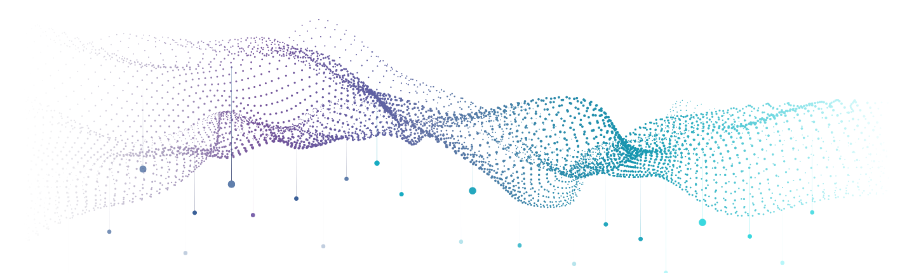

```{r Set Up Environment, include=FALSE}
knitr::opts_chunk$set(
  results='asis', 
  echo = FALSE
)
library(tidyverse)
library(glue)
remotes::install_github('rstudio/pagedown')

# Set this to true to have links turned into footnotes at the end of the document
PDF_EXPORT <- FALSE

# Holds all the links that were inserted for placement at the end
links <- c()
```


```{r Import Files, include=FALSE}
source('parsing_functions.R')


# First let's get the data, filtering to only the items tagged as
# Resume items
position_data <- read_csv('positions.csv') %>% 
  filter(in_resume) %>% 
  mutate(
    # Build some custom sections by collapsing others
    section = case_when(
      section %in% c('research_positions', 'industry_positions') ~ 'positions', 
      section %in% c('data_science_writings', 'by_me_press') ~ 'writings',
      TRUE ~ section
    )
  ) 

```


Aside
================================================================================


{width=900%}
<br>
<br>

Contact Info {#contact}
--------------------------------------------------------------------------------

- <i class="fa fa-envelope"></i> [annaeckenrode](mailto:annaeckenrode@bellsouth.net)
- <i class="fa fa-phone"></i> (803) 292-6362
- <i class="fa fa-link"></i> [LinkedIn](https://www.linkedin.com/in/anna-r-eckenrode/)
- <i class="fa fa-github"></i> [GitHub](https://github.com/areckenrode)


Skills {#skills}
--------------------------------------------------------------------------------
```{r}
skills <- tribble(
  ~skill,               ~level,
  "R",                  4.7,
  "tidyverse",          4.45,
  "STATA",              4.2,
  "SAS",                4.15,
  "Tableau",            3.1,
  "Python",             1.0
)
build_skill_bars(skills)
```


Contributions {#open-source}
--------------------------------------------------------------------------------
USAID Data Services products: <br>

[WE3 Dashboard](https://idea.usaid.gov/women-e3)<br>
[Country Dashboard](https://idea.usaid.gov/cd)<br>
[Collecting Taxes Database](https://idea.usaid.gov/domestic-revenue-mobilization)<br>


More info {#more-info}
--------------------------------------------------------------------------------

Hold a Secret Level Security Clearance <br>

Obtained certificates for courses 

   - HarvardX Data Science: R Basics
   - HarvardX Data Science: Visualization
   - DataCamp: Introduction to Data Science in Python
   - DataCamp: Introduction to Git


Disclaimer {#disclaimer}
--------------------------------------------------------------------------------

Made w/ [**pagedown**](https://github.com/rstudio/pagedown). 

Template from [github.com/](https://github.com/nstrayer/cv).

Last updated on `r Sys.Date()`.


Main
================================================================================

Anna R. Eckenrode {#title}
--------------------------------------------------------------------------------

```{r}
intro_text <- "

Currently searching for a data-centric position that allows me to build tools using visualization, to conduct analysis based on econometric methods, and to utilize my programming languages in a creative way.  

"


cat(sanitize_links(intro_text))
```


Selected Experience {data-icon=pie-chart}
--------------------------------------------------------------------------------

```{r}
position_data %>% print_section('positions')
```


Education {data-icon=graduation-cap data-concise=true}
--------------------------------------------------------------------------------

```{r}
position_data %>% print_section('education')
```


Selected Writing {data-icon=newspaper}
--------------------------------------------------------------------------------


```{r}
position_data %>% print_section('writings')
```


```{r}
if(PDF_EXPORT){
  cat("
  
Links {data-icon=link}
--------------------------------------------------------------------------------

<br>


")
  
  walk2(links, 1:length(links), function(link, index){
    print(glue('{index}. {link}'))
  })
}
```

